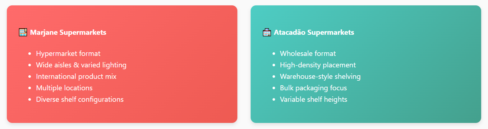

Data Documentation
==================

Overview
--------

The OSA (Out of Stock Alert) project leverages a multi-source dataset strategy combining real-world retail imagery with specialized annotations for both void detection and product recognition tasks.

Data Sources and Collection
---------------------------

Real-World Retail Environment Data
~~~~~~~~~~~~~~~~~~~~~~~~~~~~~~~~~~

Our primary data collection focused on capturing authentic retail scenarios from major supermarket chains in Morocco.

**Data Collection Sites**

**Collection Methodology**

- Systematic aisle-by-aisle documentation
- Multiple visits at different times
- Various lighting conditions and shelf states
- Comprehensive coverage across product categories

Void Detection Dataset Development
----------------------------------

Annotation with Roboflow
~~~~~~~~~~~~~~~~~~~~~~~~

We used **Roboflow** to create high-quality annotations for void detection, leveraging its collaborative annotation tools and quality control features.

**Void Detection Types**

- **Complete Void**: Entire shelf section with no products
- **Partial Void**: Sections with reduced product density
- **Gap Void**: Small gaps between products
- **Edge Void**: Empty spaces at shelf edges

.. image:: _static/void.jpg
   :alt: Examples of void detection annotations
   :align: center
   :width: 75%

*Figure: Examples of different void types and annotations*

**Annotation Process**

1. Initial labeling of void areas
2. Quality review by experienced annotators
3. Final validation for consistency
4. Integration into training dataset

**Custom Void Detection Dataset**

- **Dataset Name**: OSA Void Detection Dataset  
- **Description**: Custom-built dataset for detecting empty spaces on retail shelves  
- **Format**: YOLO format annotations via Roboflow  
- **Size**: Real-world retail images with void annotations  
- **Source**: Custom collection from Moroccan retail chains  
- **Annotation Tool**: Roboflow platform  
- **Types**: Complete voids, partial voids, gap voids, and edge voids  
- **Link**: `Void Detection Dataset <https://www.kaggle.com/datasets/void-detection>`_

Product Detection Dataset
-------------------------

Open Source SKU Dataset from Kaggle
~~~~~~~~~~~~~~~~~~~~~~~~~~~~~~~~~~~

For product detection, we integrated a comprehensive **SKU dataset** from Kaggle, providing extensive product category coverage with professional-grade annotations.

**Dataset Characteristics**

- High-resolution product images
- Extensive product category coverage
- COCO-style annotations with detailed classifications
- Multi-level product hierarchy

**Integration Process**

- Format standardization and category mapping
- Quality filtering and metadata enrichment
- Image normalization and augmentation
- Performance benchmarking

**Open Source SKU Dataset**

- **Dataset Name**: Open Source SKU Dataset  
- **Description**: Comprehensive collection of retail product images with bounding box annotations for product detection  
- **Format**: COCO JSON format with image files  
- **Size**: Multiple product categories with detailed annotations  
- **Source**: Kaggle open source community  
- **Link**: `SKU Detection Dataset <https://www.kaggle.com/datasets/thedatasith/sku110k-annotations>`_

Data Preprocessing Pipeline
---------------------------

**Standard Processing Steps**

1. Image format standardization (JPEG, PNG)
2. Resolution normalization (640x640 for YOLO models)
3. Annotation format conversion (COCO → YOLO)
4. Dataset splitting (train/validation/test: 70/20/10)
5. Data augmentation and quality checks

Related Resources
-----------------

- `Roboflow <https://roboflow.com>`_ – Annotation and dataset management platform used for void detection dataset  
- `Kaggle <https://www.kaggle.com>`_ – Source platform for SKU detection dataset
