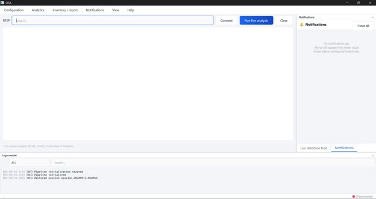
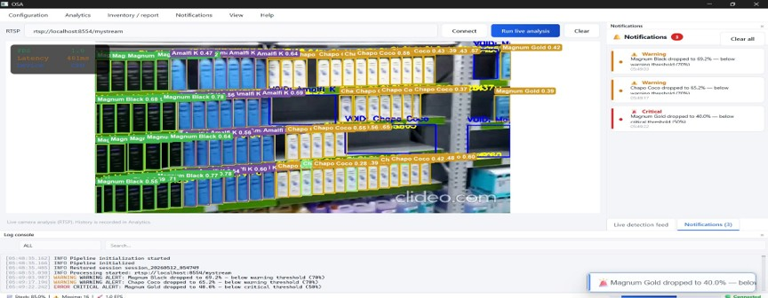
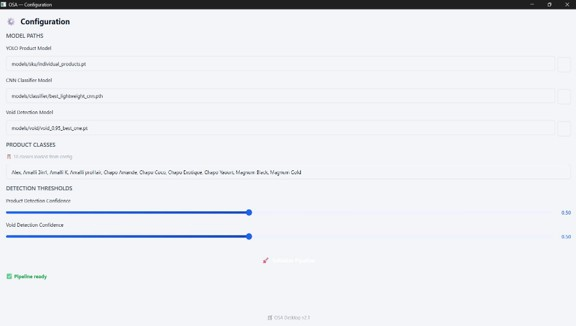
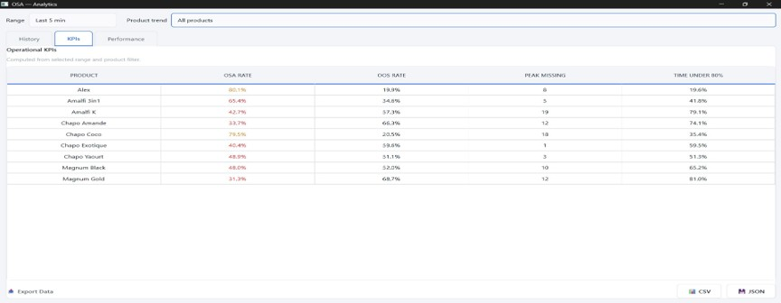
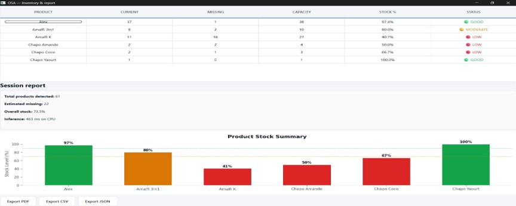
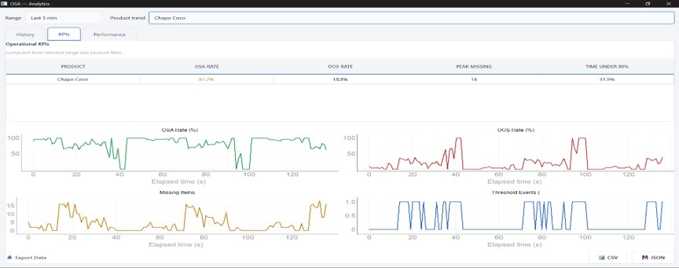
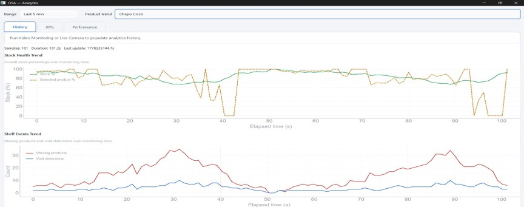
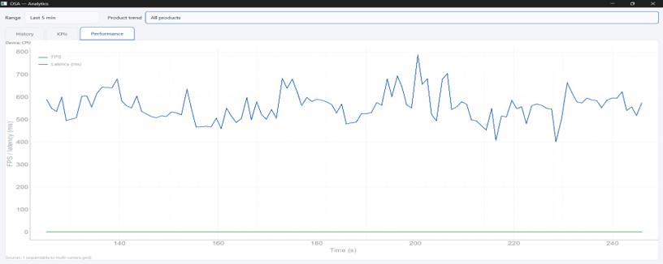

=============================================
OSA-Desktop: Industrial Control Centre
=============================================

Overview
========

The **OSA-Desktop** application is a powerful PyQt6-based industrial control centre designed for single-operator, live RTSP monitoring. It serves as the local interface for the On-Shelf Availability (OSA) system, allowing real-time AI-powered shelf analysis directly from a camera feed without the need for a web server.

Features
========

* **Live RTSP Stream Analysis**: Connects directly to continuous CCTV streams without the overhead of static media processing.
* **Hardware Accelerated AI Pipeline**: Utilizes YOLO for product/void detection and CNN for SKU classification, optimized for the best available hardware accelerator.
* **Modern UI**: Features Docker Light and OSA Dark themes, interactive bounding boxes, and comprehensive HUD overlays.
* **Robust Alert System**: Provides threshold-based notifications, warning/critical states, and recovery detection directly to the user.

User Interface
==============

Home Dashboard
--------------

The Home dashboard provides an immediate overview of the system's operational status and live metrics.

Real-Time Detection
-------------------

Connect to a live RTSP feed and watch the AI pipeline in action. The interface overlays bounding boxes for detected products, voids, and classification confidences.

Configuration
-------------

Configure the pipeline easily using the settings panel. Users can adjust confidence thresholds, select models, and fine-tune alerting behaviors.

Analytics & Reporting
===================

KPIs Overview
-------------

The KPI dashboard translates raw detections into actionable industry-standard metrics, including OSA Rate, Out-Of-Stock (OOS) Rate, and Peak Missing items.

Stock Inventory
---------------

View the live stock table detailing exact capacities, missing items, and current stock percentages for every product category.

KPI Evolution per Product
-------------------------

Deep dive into the temporal evolution of specific products with dynamic 2x2 grid charts, mapping availability trends over the active session.

Comprehensive Analytics
-----------------------

A broader look at all collected analytics data, enabling comprehensive reporting and export to CSV, JSON, or PDF formats.

System Performance
------------------

Monitor the hardware usage, AI pipeline latency (ms), and frame processing rate (FPS) in real-time.

