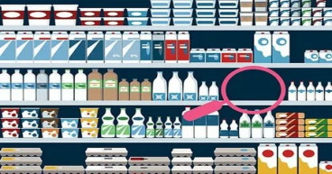

Welcome to My Project Documentation!
===============================================

On-Shelf Availability (OSA) Analysis
===========================================

------------

------------

Our Team
------------

This innovative project was carried out by a team of students passionate about artificial intelligence and its practical applications in the retail sector, under the supervision of a recognized expert in the field.

Team Members
~~~~~~~~~~~~~~~~~~~

- **Es-safi Abderrahman** – AI and Data Technologies Engineering student  
    `LinkedIn <https://www.linkedin.com/in/abderrahman-es-safi-773739329/>`__

- **Faris Amine** – AI and Data Technologies Engineering student   
    `LinkedIn <https://www.linkedin.com/in/amine-faris-645096277/>`__

Project Supervisor
~~~~~~~~~~~~~~~~~~~

- **Prof. Tawfik Masrour** – Professor, AI expert  
    Research Director in applied artificial intelligence and project mentor  
    `LinkedIn <https://www.linkedin.com/in/tawfik-masrour-43163b85/>`__

Field of Study: IADT-SI
~~~~~~~~~

Period: 01-2025 / 06-2025
~~~~~~~~~

.. toctree::
   :maxdepth: 2
   :caption: Table of Contents

   introduction
   models
   train_models_results
   solution_2
   user_guide_2