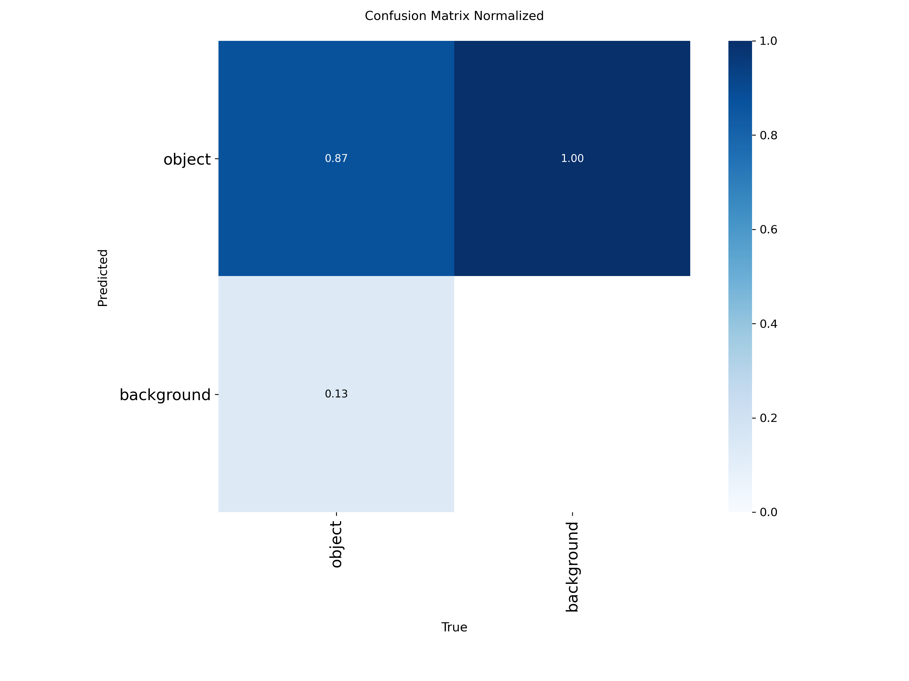
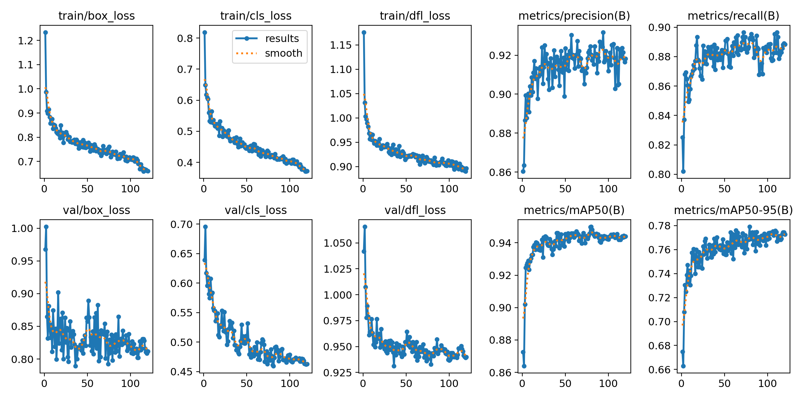

Pre-trained Models
==================

The system uses two pre-trained detection models based on YOLOv8 or similar architecture:

void.pt
-------

Model dedicated to identifying empty spaces.

**Characteristics:**

- Precise detection of locations without products.
- Differentiation between intentional empty space and stockout.
- Takes into account price tags and separators.

individual_products.pt
-----------------------

Model specialized in detecting individual products (SKU - Stock Keeping Unit).

**Characteristics:**

- Fine identification of precise product references.
- Ability to distinguish variants of the same product (size, flavor, format).
- Useful for automatic restocking tasks or planogram verification.
- High precision for detailed classification tasks in complex environments.

====================================
Model Training Results
====================================

This documentation presents the training results of different models used in our On-Shelf Availability (OSA) detection system.

.. contents:: Table of Contents
   :depth: 3
   :local:

Empty Space Detection (void.pt)
===============================

Architecture Comparison
-----------------------

We evaluated several approaches for empty space detection:

1. YOLOv8 with original Marjan dataset 200 images 
2. YOLOv8 with data augmentation 600 images 
3. Transfer Learning from YOLOv8 model with augmented dataset with a 2300 image dataset via Kaggle
4. YOLOv8 with data augmentation with a dataset via Roboflow of 3000 images  
5. YOLOv11 
6. DETR (transformer approach)

YOLOv8 - Original Dataset
^^^^^^^^^^^^^^^^^^^^^^^^^

.. list-table:: YOLOv8 Performance - Original Dataset
   :widths: 25 20 20 20 15
   :header-rows: 1

   * - Metric
     - mAP50
     - mAP50-95
     - Precision
     - Recall
   * - Global
     - 0.743
     - 0.359
     - 0.832
     - 0.635

**Applied Augmentations**: None

   YOLOv8 confusion matrix for empty space detection

.. figure:: _static/images/void/void_1_results.png
   :alt: YOLOv8 precision-recall curve for empty space detection
   :width: 80%
   :align: center

   YOLOv8 training curves for empty space detection

YOLOv8 - Augmented Dataset
^^^^^^^^^^^^^^^^^^^^^^^^^

.. list-table:: YOLOv8 Performance - Augmented Dataset
   :widths: 25 20 20 20 15
   :header-rows: 1

   * - Metric
     - mAP50
     - mAP50-95
     - Precision
     - Recall
   * - Global
     - 0.723
     - 0.366
     - 0.695
     - 0.695

**Applied Augmentations**:
- 50% probability of horizontal flip
- Random cropping (0-16%)
- Rotation (-14° to +14°)
- Brightness adjustment (±25%)
- Gaussian blur (0-0.7 pixels)

.. figure:: _static/images/void/void_2_matrix.png
   :alt: YOLOv8 confusion matrix for empty space detection
   :width: 80%
   :align: center

   YOLOv8 confusion matrix for empty space detection

.. figure:: _static/images/void/void_2_results.png
   :alt: YOLOv8 precision-recall curve for empty space detection
   :width: 80%
   :align: center

   YOLOv8 training curves for empty space detection

YOLOv8 - Transfer Learning
^^^^^^^^^^^^^^^^^^^^^^^^^^
Using Kaggle dataset
.. list-table:: Transfer Learning Performance
   :widths: 25 20 20 20 15
   :header-rows: 1

   * - Metric
     - mAP50
     - mAP50-95
     - Precision
     - Recall
   * - Global
     - 0.62
     - 0.301
     - 0.644
     - 0.551

**Analysis**: Transfer learning did not yield good results, probably due to overfitting on the source dataset.

.. figure:: _static/images/void/void_3_tf_matrix.png
   :alt: YOLOv8 confusion matrix for empty space detection
   :width: 80%
   :align: center

   YOLOv8 confusion matrix for empty space detection

.. figure:: _static/images/void/void_3_tf_results.png
   :alt: YOLOv8 precision-recall curve for empty space detection
   :width: 80%
   :align: center

   YOLOv8 training curves for empty space detection

YOLOv8 - Augmented Dataset
^^^^^^^^^^^^^^^^^^^^^^^^^^

.. list-table:: Performance - Augmentation
   :widths: 25 20 20 20 15
   :header-rows: 1

   * - Metric
     - mAP50
     - mAP50-95
     - Precision
     - Recall
   * - Global
     - 0.708
     - 0.376
     - 0.712
     - 0.665

   YOLOv8 confusion matrix for empty space detection

.. figure:: _static/images/void/void_4_results.png
   :alt: YOLOv8 precision-recall curve for empty space detection
   :width: 80%
   :align: center

   YOLOv8 training curves for empty space detection

YOLOv8 - New Dataset + Marjan Dataset
^^^^^^^^^^^^^^^^^^^^^^^^^^

.. list-table:: Performance - Augmentation
   :widths: 25 20 20 20 15
   :header-rows: 1

   * - Metric
     - mAP50
     - mAP50-95
     - Precision
     - Recall
   * - Global
     - 0.9544
     - 0.66
     - 0.932
     - 0.91

.. figure:: _static/images/void/void_5_matrix.png
   :alt: YOLOv8 confusion matrix for empty space detection
   :width: 80%
   :align: center

   YOLOv8 confusion matrix for empty space detection

.. figure:: _static/images/void/void_5_results.png
   :alt: YOLOv8 precision-recall curve for empty space detection
   :width: 80%
   :align: center

   YOLOv8 training curves for empty space detection

YOLOv11 
^^^^^^^^^^^^^^^^^^^^^^^^^^^^^^^

.. list-table:: YOLOv11 Performance - Original Dataset
   :widths: 25 20 20 20 15
   :header-rows: 1

   * - Metric
     - mAP50
     - mAP50-95
     - Precision
     - Recall
   * - Global
     - 0.73
     - 0.374
     - 0.736
     - 0.679

**Applied Augmentations**: None

.. figure:: _static/images/void/void1_yolo11_matrix.png
   :alt: YOLOv11 confusion matrix for empty space detection
   :width: 80%
   :align: center

   YOLOv11 confusion matrix for empty space detection

.. figure:: _static/images/void/void1_yolo11_results.png
   :alt: YOLOv11 precision-recall curve for empty space detection
   :width: 80%
   :align: center

   YOLOv11 training curves for empty space detection

YOLOv11 
^^^^^^^^^^^^^^^^^^^^^^^^^^^^^^^

.. list-table:: YOLOv11 Performance - Original Dataset
   :widths: 25 20 20 20 15
   :header-rows: 1

   * - Metric
     - mAP50
     - mAP50-95
     - Precision
     - Recall
   * - Global
     - 0.918
     - 0.561
     - 0.871
     - 0.865

**Applied Augmentations**: New Dataset + Marjan

.. figure:: _static/images/void/void2_yolo11_matrix.png
   :alt: YOLOv11 confusion matrix for empty space detection
   :width: 80%
   :align: center

   YOLOv11 confusion matrix for empty space detection

.. figure:: _static/images/void/void2_yolo11_results.png
   :alt: YOLOv11 precision-recall curve for empty space detection
   :width: 80%
   :align: center

   YOLOv11 training curves for empty space detection

DETR - Transformer Approach
^^^^^^^^^^^^^^^^^^^^^^^^^^^

.. list-table:: DETR Performance
   :widths: 25 20 20 20 15 20
   :header-rows: 1

   * - Metric
     - mAP50
     - mAP50-95
     - Precision
     - Recall
   * - Global
     - 0.94
     - 
     - 
     - 

.. figure:: _static/images/void/DTER_results.png
   :alt: DETR precision-recall curve for empty space detection
   :width: 80%
   :align: center

   DETR training curves for empty space detection

**Comparative Analysis**:

.. list-table:: Architecture Comparison
   :widths: 25 15 15 20 20
   :header-rows: 1

   * - Architecture
     - mAP50
     - mAP50-95
     - 
   * - YOLOv8 (original)
     - 0.65
     - 0.38
     - 12.3
     - 18.4
   * - YOLOv8 (augmented)
     - 0.66
     - 0.35
     - 12.5
     - 18.4
   * - YOLOv11
     - 0.943
     - 0.867
     - 14.1
     - 24.7
   * - DETR
     - 0.908
     - 0.835
     - 32.5
     - 158.3

**Conclusion**: YOLOv8 offers the best compromise with 95.4% mAP50 

Error Analysis
--------------

Main causes of errors:
1. **Occlusion**: Partially hidden products (23% of errors)
2. **Reflections**: On metallic packaging (17%)
3. **Visual similarity**: Between products of the same brand (15%)
4. **Small size**: Products <50px (12%)

Individual Product Detection (sku.pt)
=====================================

10k Images Dataset
^^^^^^^^^^^^^^^^^^^

.. list-table:: Shelf Detection Performance
   :widths: 30 20 20 20 15
   :header-rows: 1

   * - Metric
     - mAP50
     - mAP50-95
     - Precision
     - Recall
   * - Global
     - 0.916
     - 0.586
     - 0.905
     - 0.845

   YOLOv8 confusion matrix for object detection

   YOLOv8 normalized confusion matrix for object detection

.. figure:: _static/images/sku/sku_results.png
   :alt: YOLOv8 precision-recall curve for object detection
   :width: 80%
   :align: center

   YOLOv8 training curves for object detection.

Transfer Learning: Moroccan Products Dataset 350 Images
^^^^^^^^^^^^^^^^^^^^^^^^^^^^^^^^^^^^^^^^^^^^^^^^^^^^^^^^

.. list-table:: Shelf Detection Performance
   :widths: 30 20 20 20 15
   :header-rows: 1

   * - Metric
     - mAP50
     - mAP50-95
     - Precision
     - Recall
   * - Global
     - 0.951
     - 0.794
     - 0.91
     - 0.924

.. figure:: _static/images/sku/sku_mp_matrix.png
   :alt: YOLOv8 confusion matrix for object detection
   :width: 80%
   :align: center

   YOLOv8 confusion matrix for object detection

   YOLOv8 normalized confusion matrix for object detection

   YOLOv8 training curves for object detection.

Technical Appendices
====================

Hardware Configuration
----------------------

.. list-table:: Training Environment
   :widths: 30 70
   :header-rows: 0

   * - **GPU**
     - 8x NVIDIA A100 80GB
   * - **CPU**
     - 2x Intel Xeon Gold 6342
   * - **RAM**
     - 1TB DDR4
   * - **Storage**
     - 20TB NVMe RAID
   * - **OS**
     - Ubuntu 22.04 LTS

Datasets
--------

.. list-table:: **Dataset Statistics**
   :widths: 30 15 15
   :header-rows: 1

   * - Dataset
     - Images
     - Classes
   * - Voids
     - +8,000
     - 1
   * - Shelves
     - +6,000
     - 1
   * - Products
     - +500
     - 5
   * - Product for SKU
     - +10,000
     - 1

Glossary
--------

- **mAP50**: Mean Average Precision at IoU=50%
- **mAP50-95**: Average mAP over IoU from 50% to 95%
- **IoU**: Intersection over Union
- **TP/FP/FN**: True/False Positives, False Negatives