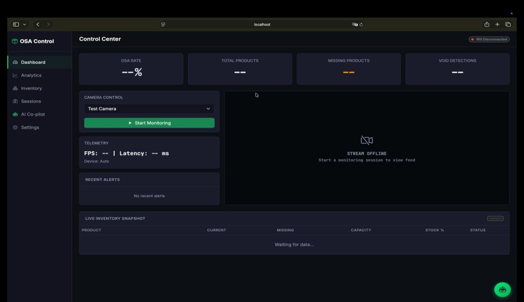
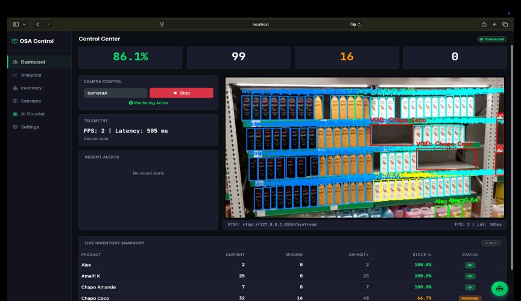
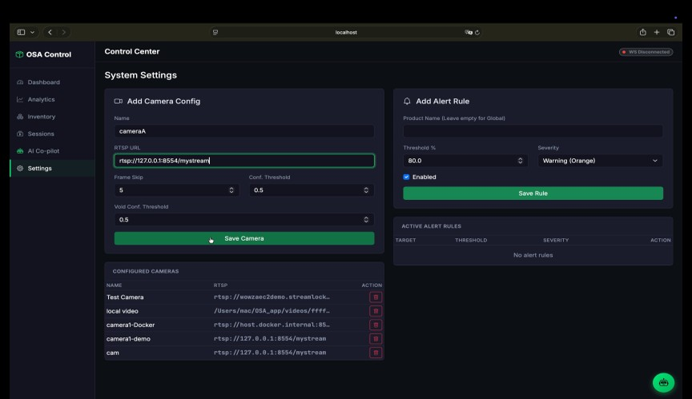
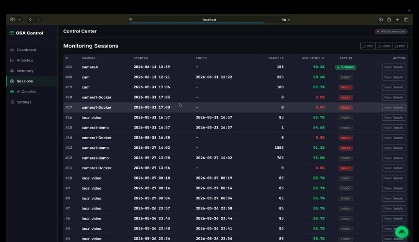
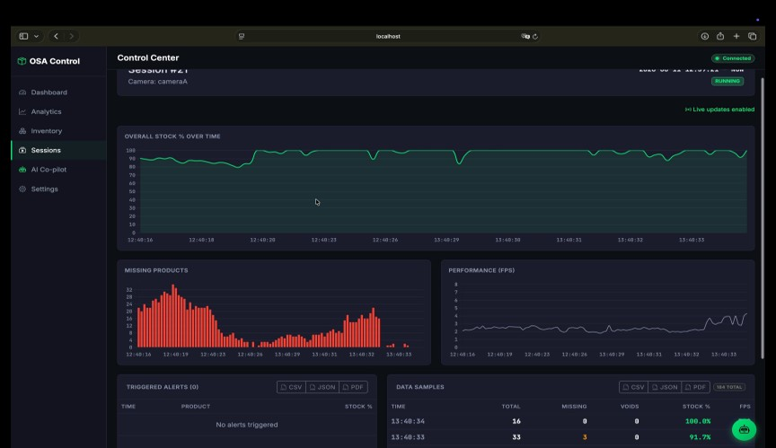
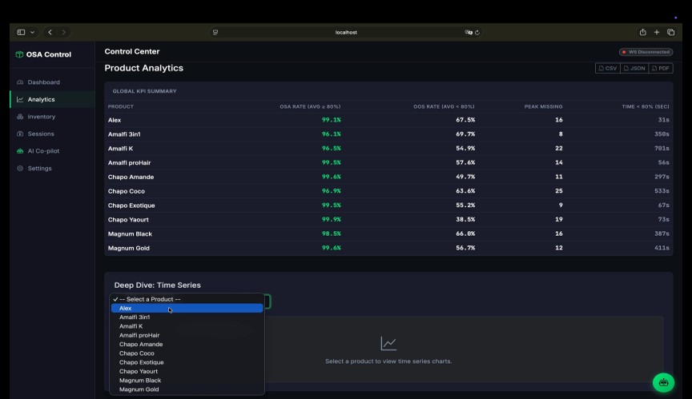
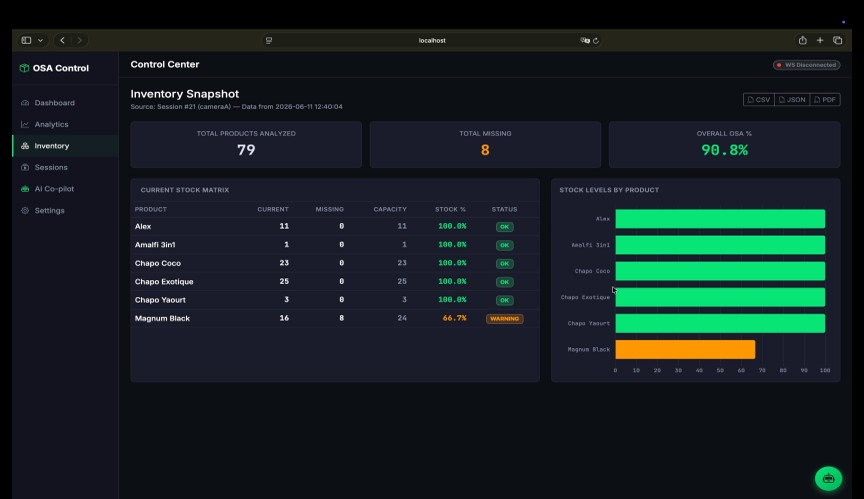
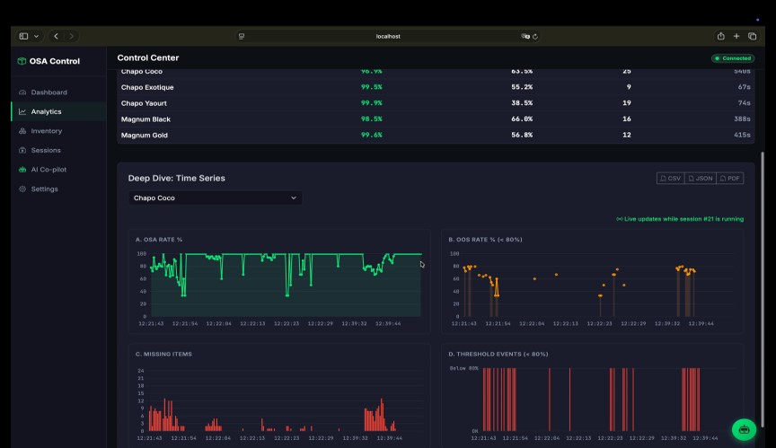
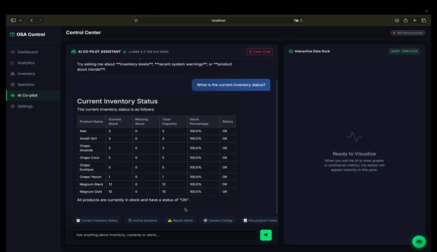
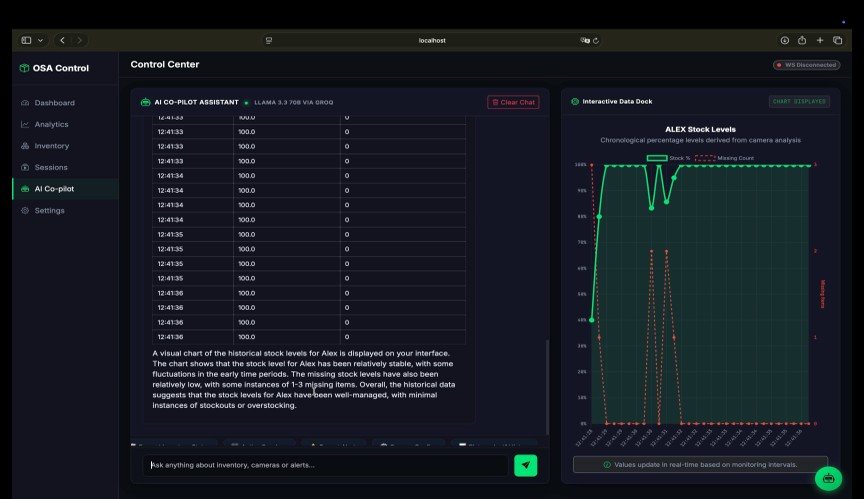

=============================================
OSA-Web: Fleet Monitoring Dashboard
=============================================

Overview
========

The **OSA-Web** dashboard is a comprehensive Django-based application designed for multi-camera fleet monitoring. It utilizes real-time WebSocket frame streaming and a Celery task queue to perform AI-powered shelf analysis asynchronously, allowing centralized management of entire retail spaces.

Features
========

* **Multi-Camera Management**: Easily configure and monitor numerous RTSP streams simultaneously.
* **Real-time WebSockets**: Streams annotated frames and live analytics directly to the browser with ultra-low latency.
* **Distributed Processing**: Utilizes Redis and Celery to execute heavy computer-vision pipelines asynchronously.
* **AI Assistant Co-Pilot**: Integrated intelligent assistant capable of understanding natural language queries and generating dynamic charts based on inventory data.

User Interface
==============

Home Dashboard
--------------

The Web Dashboard Home provides a centralized view of all active monitoring sessions, fleet-wide alerts, and top-level KPIs.

Real-Time Monitoring
--------------------

Watch a live, annotated feed of any active camera session with associated real-time metrics streaming alongside the video.

Configuration
-------------

Administrators can easily configure camera endpoints, model paths, and alert rules through the management interface.

Session Management
==================

Sessions History
----------------

Browse past monitoring sessions, review performance data, and access historical analytics.

Session Details
---------------

Examine a specific session in depth, exploring the timeline of events, threshold triggers, and overall performance during that period.

Analytics & Reporting
===================

KPIs Dashboard
--------------

Track aggregated Key Performance Indicators across the entire store or drill down into specific camera zones.

Stock Inventory
---------------

View current stock levels, missing items, and capacity data for all monitored product categories.

Temporal Analysis
-----------------

Analyze stock fluctuations and restock cycles over time using interactive temporal charts.

AI Assistant Co-Pilot
=====================

The OSA-Web dashboard includes a powerful Groq-powered AI Assistant. 

Interactive Queries
-------------------

Ask natural language questions about your inventory data (e.g., "Which products are critically low?", "Show me the restocking trends for Cola").

Dynamic Graph Generation
------------------------

The AI Assistant can generate dynamic, interactive graphs directly in the chat interface in response to complex analytical questions.

